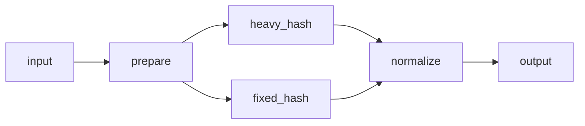

# Piper

Piper is a Rust library for building node-based data pipelines.

- `Pipe` is the fixed-width worker primitive for accumulator-style workloads.
- `Piper` is the managed pipeline harness with live outputs, graph-based fork/join execution, dynamic anchor-based worker scaling, pull-based telemetry, optional CSV telemetry, graceful shutdown, abort, and reusable internal buffer leases.
- `pipeline!` is re-exported from the runtime crate and generates a typed pipeline wrapper from either linear node sugar or named graph edges.

Forks are MPMC work-sharing fan-out: each item emitted onto a forked link is consumed by one downstream branch, not broadcast to every branch. Joins are merged streams where multiple upstream nodes send the same type into one downstream link.

Dynamic pipelines can mark one or more heavy nodes with `anchor(...)`. Use `scalable_threads(initial, max)` for scalable anchors, `fixed_threads(n)` for fixed control points that the manager tunes around but never resizes, and `with_scale_policy(NodeScalePolicy { ... })` for finer queue and scaling thresholds. Piper scales scalable anchors up to their configured maximum and scales surrounding nodes to keep anchors fed and drained.

## Fork/join graph pipeline

Graph pipelines declare every node by name in `nodes = { ... }`, then wire them with `graph = { ... }` edges. The full runnable version lives in [examples/fork_join_pipeline.rs](examples/fork_join_pipeline.rs).



```rust
use piper::{PiperConfig, anchor, node, pipeline, NodeExt};

pipeline! {
    pub struct ForkJoinPipeline {
        type Input = Batch;
        type Output = BatchLease;
        type Error = ExampleError;

        config = config();
        nodes = {
            prepare = Prepare.with_reusable_output(|| Vec::<u64>::with_capacity(BATCH_SIZE)),
            heavy_hash = anchor(HeavyHash)
                .scalable_threads(max_parallelism().div_ceil(2).max(1), max_parallelism())
                .with_reusable_output(|| Vec::<u64>::with_capacity(BATCH_SIZE)),
            fixed_hash = anchor(FixedHash)
                .fixed_threads(2)
                .with_reusable_output(|| Vec::<u64>::with_capacity(BATCH_SIZE)),
            normalize = node("normalize", Normalize),
        };
        graph = {
            input -> prepare;
            prepare -> [heavy_hash, fixed_hash];
            [heavy_hash, fixed_hash] -> normalize;
            normalize -> output;
        };
    }
}

let piper = ForkJoinPipeline::start()?;
```

### Graph syntax

| Rule | Meaning |
|------|---------|
| `nodes = { name = expr, ... }` | Each graph node is a named node expression (`Node`, `node(...)`, `anchor(...)`, etc.). |
| `graph = { a -> b; ... }` | Semicolon-separated directed edges. |
| `input` / `output` | Reserved pipeline endpoints (not node names). |
| `source -> [a, b, c]` | **Fork**: work-sharing fan-out (each item goes to one branch). |
| `[a, b, c] -> dest` | **Join**: merged input link for `dest`. |
| Every node | Must appear on both an incoming and outgoing edge. |

Fork edges are MPMC work-sharing fan-out: each item is consumed by one downstream branch, not broadcast to every branch. Join edges merge multiple upstream nodes into one downstream link.

To add more parallel branches, add a key in `nodes`, list it in the fork bracket, and list it in the matching join bracket (for example `prepare -> [a, b, c]` and `[a, b, c] -> merge`).

```bash
cargo run --release --example fork_join_pipeline
```

See [examples/fork_join_pipeline.rs](examples/fork_join_pipeline.rs) for `Node` implementations, buffer leases, telemetry, and concurrent output draining. For linear `nodes = [ ... ]` sugar without a graph, see [examples/pipeline_api_styles.rs](examples/pipeline_api_styles.rs).

## Feeder MPMC links

With the `feeder` feature enabled, `PipelineGraphBuilder::feeder_link(...)` can mark any graph link as a feeder-backed MPMC queue, including links adjacent to external nodes and the public pipeline `input` / `output` endpoints. See [examples/scaling_pipeline_feeder.rs](examples/scaling_pipeline_feeder.rs) and [examples/fork_join_feeder.rs](examples/fork_join_feeder.rs).

## External node pipeline

Use `external_node(Input, Output)` when Piper should own the graph, channels, telemetry, cancellation, and shutdown while user code owns the worker loop. The runnable example in [examples/external_node_pipeline.rs](examples/external_node_pipeline.rs) forks prepared batches to one managed hash branch and one external hash branch, then joins both branches back into a managed normalize node.

```bash
cargo run --release --example external_node_pipeline
```
